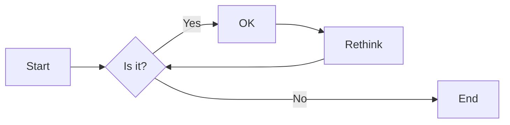

# 实验三 Python列表

班级： 21计科04

学号： B20210302411

姓名： 蒋锐

Github地址：<https://github.com/yourusername/python_course>

CodeWars地址：<https://www.codewars.com/users/yourusername>

---

## 实验目的

1. 学习Python的简单使用和列表操作
2. 学习Python中的if语句

## 实验环境

1. Git
2. Python 3.10
3. VSCode
4. VSCode插件

## 实验内容和步骤

### 第一部分

Python列表操作

完成教材《Python编程从入门到实践》下列章节的练习：

- 第3章 列表简介
- 第4章 操作列表
- 第5章 if语句

---

### 第二部分

在[Codewars网站](https://www.codewars.com)注册账号，完成下列Kata挑战：

---

#### 第一题：3和5的倍数（Multiples of 3 or 5）

难度： 6kyu

如果我们列出所有低于 10 的 3 或 5 倍数的自然数，我们得到 3、5、6 和 9。这些数的总和为 23. 完成一个函数，使其返回小于某个整数的所有是3 或 5 的倍数的数的总和。此外，如果数字为负数，则返回 0。

注意：如果一个数同时是3和5的倍数，应该只被算一次。

**提示：首先使用列表解析得到一个列表，元素全部是3或者5的倍数。
使用sum函数可以获取这个列表所有元素的和.**

代码提交地址：
<https://www.codewars.com/kata/514b92a657cdc65150000006>

---

#### 第二题： 重复字符的编码器（Duplicate Encoder）

难度： 6kyu

本练习的目的是将一个字符串转换为一个新的字符串，如果新字符串中的每个字符在原字符串中只出现一次，则为"("，如果该字符在原字符串中出现多次，则为")"。在判断一个字符是否是重复的时候，请忽略大写字母。

例如:

```python
"din"      =>  "((("
"recede"   =>  "()()()"
"Success"  =>  ")())())"
"(( @"     =>  "))(("
```

代码提交地址:
<https://www.codewars.com/kata/54b42f9314d9229fd6000d9c>

---

#### 第三题：括号匹配（Valid Braces）

难度：6kyu

写一个函数，接收一串括号，并确定括号的顺序是否有效。如果字符串是有效的，它应该返回True，如果是无效的，它应该返回False。
例如：

```python
"(){}[]" => True 
"([{}])" => True
 "(}" => False
 "[(])" => False 
"[({})](]" => False
```

**提示：
python中没有内置堆栈数据结构，可以直接使用`list`来作为堆栈，其中`append`方法用于入栈，`pop`方法可以出栈。**

代码提交地址
<https://www.codewars.com/kata/5277c8a221e209d3f6000b56>

---

#### 第四题： 从随机三元组中恢复秘密字符串(Recover a secret string from random triplets)

难度： 4kyu

有一个不为你所知的秘密字符串。给出一个随机三个字母的组合的集合，恢复原来的字符串。

这里的三个字母的组合被定义为三个字母的序列，每个字母在给定的字符串中出现在下一个字母之前。"whi "是字符串 "whatisup "的一个三个字母的组合。

作为一种简化，你可以假设没有一个字母在秘密字符串中出现超过一次。

对于给你的三个字母的组合，除了它们是有效的三个字母的组合以及它们包含足够的信息来推导出原始字符串之外，你可以不做任何假设。特别是，这意味着秘密字符串永远不会包含不出现在给你的三个字母的组合中的字母。

测试用例：

```python
secret = "whatisup"
triplets = [
  ['t','u','p'],
  ['w','h','i'],
  ['t','s','u'],
  ['a','t','s'],
  ['h','a','p'],
  ['t','i','s'],
  ['w','h','s']
]
test.assert_equals(recoverSecret(triplets), secret)
```

代码提交地址：
<https://www.codewars.com/kata/53f40dff5f9d31b813000774/train/python>

提示：

- 利用集合去掉`triplets`中的重复字母，得到字母集合`letters`，最后的`secret`应该由集合中的字母组成，`secret`长度也等于该集合。

```python
letters = {letter for triplet in triplets for letter in triplet }
length = len(letters)
```

- 创建函数`check_first_letter(triplets, first_letter)`，检测一个字母是不是secret的首字母，返回True或者False。
- 创建函数`remove_first_letter(triplets, first_letter)`,  从三元组中去掉首字母，返回新的三元组。
- 遍历字母集合letters，利用上面2个函数得到最后的结果`secret`。

---

#### 第五题： 去掉喷子的元音（Disemvowel Trolls）

难度： 7kyu

喷子正在攻击你的评论区!
处理这种情况的一个常见方法是删除喷子评论中的所有元音(字母：a,e,i,o,u)，以消除威胁。
你的任务是写一个函数，接收一个字符串并返回一个去除所有元音的新字符串。
例如，字符串 "This website is for losers LOL!"   将变成 "Ths wbst s fr lsrs LL!".

注意：对于这个Kata来说，y不被认为是元音。
代码提交地址：
<https://www.codewars.com/kata/52fba66badcd10859f00097e>

提示：

- 首先使用列表解析得到一个列表，列表中所有不是元音的字母。
- 使用字符串的join方法连结列表中所有的字母，例如：

```python
last_name = "lovelace"
letters = [letter for letter in last_name ]
print(letters) # ['l', 'o', 'v', 'e', 'l', 'a', 'c', 'e']
name = ''.join(letters) # name = "lovelace"
```

---

### 第三部分

使用Mermaid绘制程序流程图

安装VSCode插件：

- Markdown Preview Mermaid Support
- Mermaid Markdown Syntax Highlighting

使用Markdown语法绘制你的程序绘制程序流程图（至少一个），Markdown代码如下：


显示效果如下：



查看Mermaid流程图语法-->[点击这里](https://mermaid.js.org/syntax/flowchart.html)

使用Markdown编辑器（例如VScode）编写本次实验的实验报告，包括[实验过程与结果](#实验过程与结果)、[实验考查](#实验考查)和[实验总结](#实验总结)，并将其导出为 **PDF格式** 来提交。

## 实验过程与结果

请将实验过程与结果放在这里，包括：

- [第一部分 Python列表操作和if语句](#第一部分)
- [第二部分 Codewars Kata挑战](#第二部分)
* 第一题：3和5的倍数（Multiples of 3 or 5）
```python
def solution(number):
    pass
    sum=0
    for i in range (1,number):
        if i%3==0 or i%5==0:
            sum+=i
    return sum
```
* 第二题： 重复字符的编码器（Duplicate Encoder）
```python
def duplicate_encode(word):
    #your code here
    str=''
    word=word.lower()
    for i in word:
        if word.count(i)==1 :
            str+='('
        else :
            str+=')'
    return str
```
* 第三题：括号匹配（Valid Braces）
```python
def valid_braces(string):
    str=[]
    for i in string:
        if i=='(' or i=='{' or i=='[' :
            str.append(i)
        else :
            if len(str)==0 :
                return False
            flag=str.pop()
            if flag=='(' and i==')':
                continue
            elif flag=='{' and i=='}':
                continue
            elif flag=='[' and i==']':
                continue
            else :
                return False
    if len(str)!=0:
        return False
    return True        
```
* 第四题 从随机三元组中恢复秘密字符串(Recover a secret string from random triplets)
```python
def recoverSecret(triplets):
    'triplets is a list of triplets from the secrent string. Return the string.'
    lic = []
    for i in range(len(triplets)):
        for j in range(len(triplets[i])):
            lic.append(triplets[i][j])
 
    lic = set(lic)
    lic = list(lic)
    while True:
        cnt = 0
        for i in range(len(triplets)):
            for j in range(len(triplets[i]) - 1):
                a = triplets[i][j]
                b = triplets[i][j + 1]
                index_a = lic.index(a)
                index_b = lic.index(b)
                if index_a > index_b:
                    temp = lic[index_b]
                    lic[index_b] = lic[index_a]
                    lic[index_a] = temp
                    cnt += 1
        if cnt == 0:
            return ''.join(lic)

```
* 第五题： 去掉喷子的元音（Disemvowel Trolls
```python
def disemvowel(string_):
    ans=''
    for i in string_ :
        if i in ['a','o','e','i','u','A','O','U','I','E'] :
            continue
        else :
            ans+=i
    string_=ans
    return string_
```

- [第三部分 使用Mermaid绘制程序流程图](#第三部分)


注意代码需要使用markdown的代码块格式化，例如Git命令行语句应该使用下面的格式：


显示效果如下：

```bash
git init
git add .
git status
git commit -m "first commit"
```

如果是Python代码，应该使用下面代码块格式，例如：


显示效果如下：

```python
def add_binary(a,b):
    return bin(a+b)[2:]
```

代码运行结果的文本可以直接粘贴在这里。

**注意：不要使用截图，Markdown文档转换为Pdf格式后，截图可能会无法显示。**

## 实验考查

请使用自己的语言并使用尽量简短代码示例回答下面的问题，这些问题将在实验检查时用于提问和答辩以及实际的操作。

1. Python中的列表可以进行哪些操作？
* 可以进行增删改查操作，列表循环，运算，排序等等操作。
2. 哪两种方法可以用来对Python的列表排序？这两种方法有和区别？
* 方法1.用List的内建函数list.sort进行排序 list.sort (func=None, key=None, reverse=False) Python实例： 方法2.用序列类型函数sorted (list)进行排序 Python实例： 两种方法的区别： sorted (list)返回一个对象，可以用作表达式。
3. 如何将Python列表逆序打印？
* 1.使用reverse函数 2.对列表进行切片操作 3.下标进行反向输出
4. Python中的列表执行哪些操作时效率比较高？哪些操作效率比较差？是否有类似的数据结构可以用来替代列表？
* 在Python中，执行以下操作时，列表的效率比较高：

1. 访问列表中的元素，即索引访问 (e.g., lst[index])。
2. 在末尾添加元素，即使用append()方法 (e.g., lst.append(element))。
3. 在列表开头添加元素，即使用insert()方法 (e.g., lst.insert(0, element))。
4. 确定列表的长度，即使用len()函数 (e.g., len(lst))。
5. 迭代列表中的元素，即使用for循环 (e.g., for item in lst: ...)。
6. 切片操作，即使用lst[start:end]获取子列表。

以下操作的效率比较差，尤其在处理较大的列表时：

1. 在列表中间插入或删除元素，即使用insert()或remove()方法 (e.g., lst.insert(index, element))。
2. 在列表中查找元素，即使用in关键字进行查找 (e.g., element in lst)。
3. 列表的排序，即使用sort()方法 (e.g., lst.sort())。

可以使用数组 (array) 或链表 (linked list) 这样的数据结构来替代列表，具体根据具体情况选择合适的数据结构。数组在随机访问和迭代方面效率较高，而链表在插入和删除元素方面效率较高。 Python中可以使用`array`模块或第三方库`numpy`来使用数组，而链表可以通过自定义节点类实现。但是需要注意的是，这些替代方案通常需要额外的库或者实现代码，并不像列表一样内置于Python标准库。

5. 阅读《Fluent Python》Chapter 2. An Array of Sequence - Tuples Are Not Just Immutable Lists小节（p30-p35）。总结该小节的主要内容。
* 《Fluent Python》第2章《An Array of Sequence - Tuples Are Not Just Immutable Lists》介绍了元组（Tuple）的特点和用法。以下是该小节的主要内容总结：

1. 元组是不可变序列：与列表不同，元组一旦创建就不能修改，包括添加、删除或修改元素。这使得元组更加高效和安全。

2. 元组的创建：可以使用逗号将多个值组合在一起，也可以使用圆括号括起来的表达式来创建元组。空元组可以通过()或tuple()来创建。

3. 元组拆包和赋值：可以使用元组拆包将元组的元素分配给多个变量。同时，可以通过赋值来交换变量的值，而无需使用临时变量。

4. 元组作为记录：可以使用元组将相关信息组成记录。每个元组元素的位置代表其含义，可以通过索引访问。

5. 元组拆包的应用：元组拆包还可以方便地将函数的多个返回值分配给多个变量，从字典中获取键-值对等。

6. 命名元组：命名元组是具有字段名的元组。它们提供了更好的可读性和自文档化，可以像普通元组一样进行索引和迭代。

7. zip()函数：zip()函数可以将多个可迭代对象合并为一个元组的列表。它返回的是一个迭代器，可以使用list()函数将其转换为列表。

8. 使用*运算符：在元组拆包时，可以使用*运算符收集多余的元素。这样可以简化代码，并且不需要关心具体数量的元素。

9. 元组的不可变性：元组的不可变性指的是不能改变元组中的元素。但是，如果元组的某个元素本身是可变对象，那么该对象是可以进行修改的。

以上是《Fluent Python》第2章小节的主要内容总结。该小节介绍了元组的特点、创建方式、拆包赋值、命名元组以及一些常用的操作和技巧。阅读完该小节后，读者可以更好地理解和应用元组在Python中的用法。
## 实验总结

总结一下这次实验你学习和使用到的知识，例如：编程工具的使用、数据结构、程序语言的语法、算法、编程技巧、编程思想。
